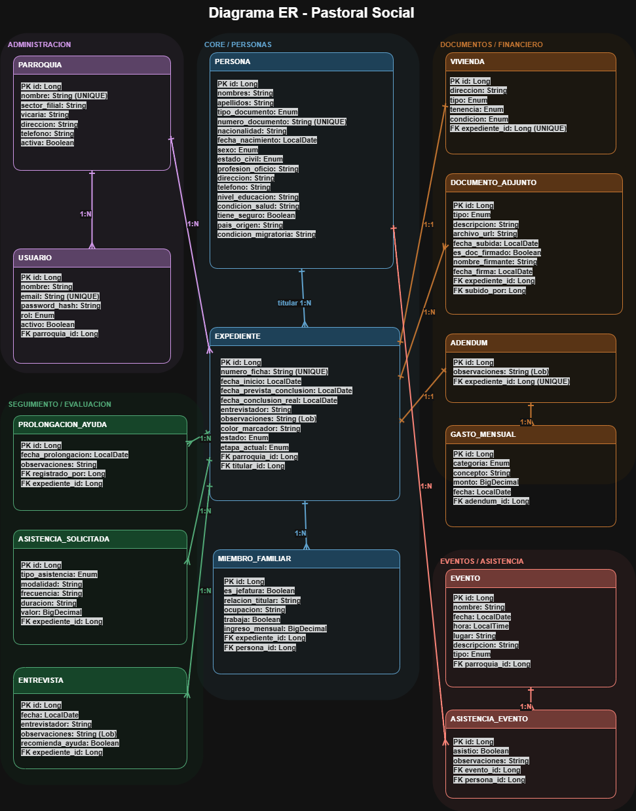

# Contexto del proyecto

La Pastoral Social de una provincia religiosa opera actualmente sin un sistema informático que centralice la gestión de sus beneficiarios. Cada sede (iglesia u ONG asociada) trabaja de forma independiente con registros manuales, lo que genera un problema estructural: una misma persona puede presentarse en múltiples sedes y recibir ayuda repetida sin que nadie lo detecte.
Esto no solo implica un uso inequitativo de recursos limitados (comestibles, medicamentos, ayuda económica), sino que también priva a familias verdaderamente vulnerables de recibir la asistencia que merecen.

# Objetivo principal del proyecto

Desarrollar un sistema de gestión centralizada de beneficiarios, mediante el cual la Pastoral Social de la provincia pueda registrar, controlar y dar seguimiento a las ayudas sociales otorgadas, evitando duplicidades entre residencias o instituciones beneficiarias, garantizando así una distribución equitativa de los recursos disponibles.

## Diagrama del sistema

## Objetivos secundarios

### Operativos

- Digitalizar el flujo completo de atención al beneficiario, eliminando el registro en papel y sus riesgos de pérdida o inconsistencia.
- Centralizar la gestión documental (comprobantes, cartas, recibos médicos) vinculada a cada caso.

### De control

- Implementar un sistema de roles y permisos que delimite qué puede ver o hacer cada actor según su sede y nivel jerárquico.
- Generar alertas o bloqueos automáticos ante intentos de registro duplicado entre sedes de la provincia.

### De trazabilidad

- Mantener un historial completo por beneficiario: entrevistas, evaluaciones, acuerdos vigentes y beneficios recibidos.
- Registrar el motivo de rechazo cuando un candidato no califica, para auditoría posterior.

### De experiencia y Analíticos

- Reducir el tiempo administrativo del voluntario durante el proceso de atención mediante flujos guiados dentro del sistema.
- Proveer a la coordinación provincial de reportes de alcance: cuántas familias atendidas, qué tipo de ayuda, con qué frecuencia y en qué sedes.

## Proyecto Universitario

Este proyecto fue desarrollado como trabajo académico en la Universidad Latina de Costa Rica.
